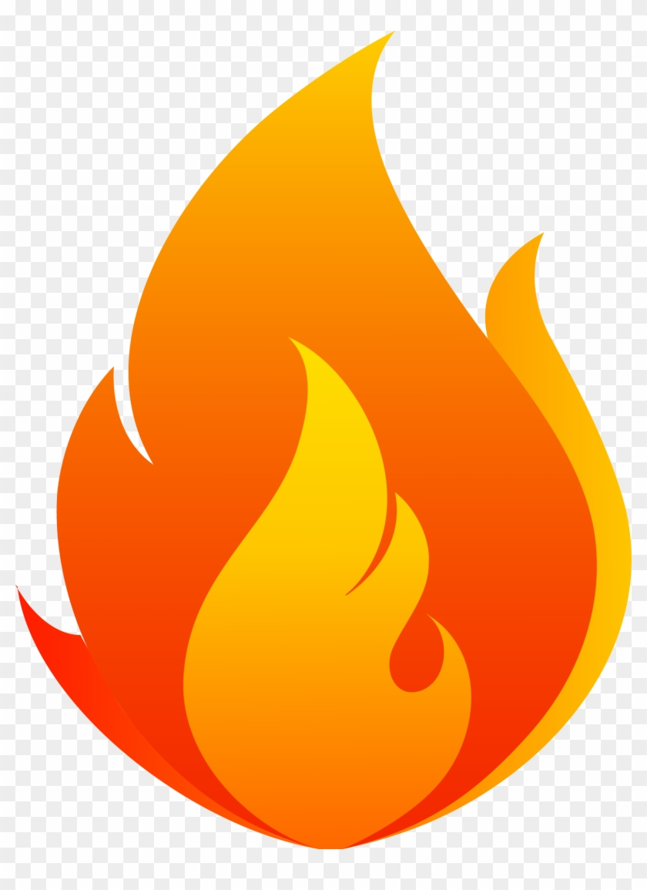
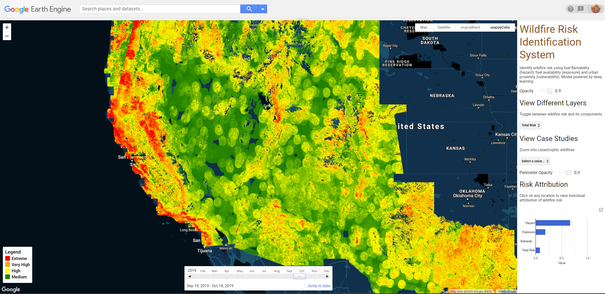
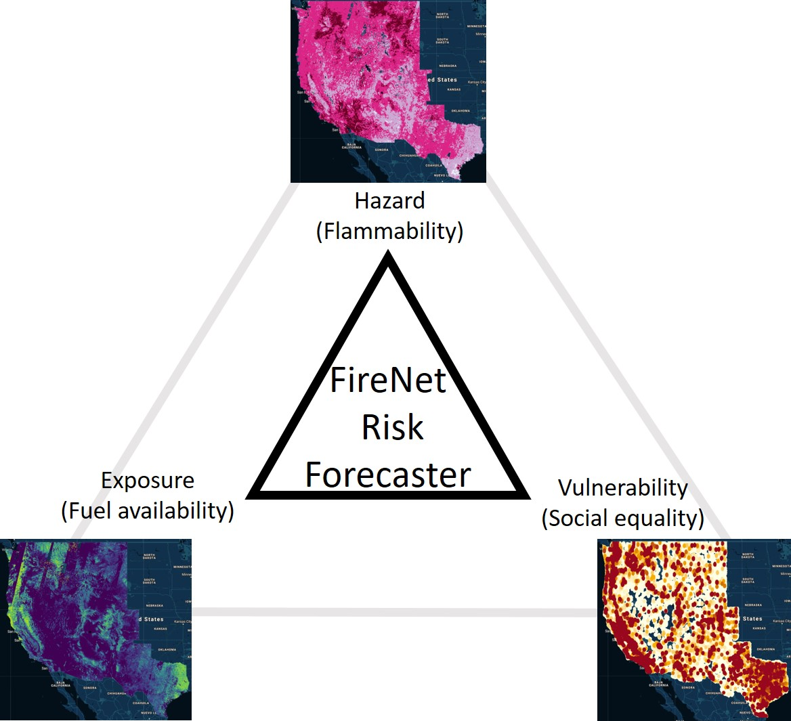
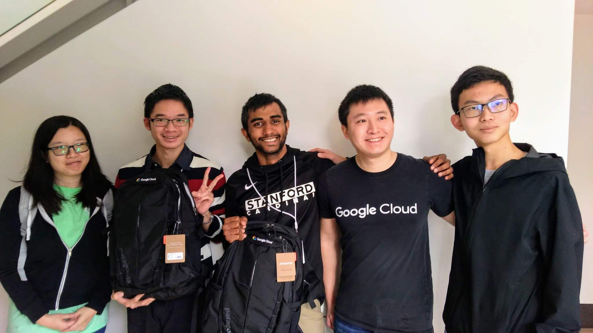

#  FireNet: Wildfire Risk Identification System

Tree our web-based risk forecasting tool [here](https://kkraoj.users.earthengine.app/view/wildfire-danger).

## Why forecast wildfire risk?
Climate change is exacerbating wildfire likelihood and severity in the western USA. For instance, in the state of California, USA, in the last century, 12 of the largest wildfires, 13 of the most destructive wildfires, and 7 of the deadliest wildfires occurred during the last decade. Wildfires emit massive amounts of harmful particulate matter posing a direct threat to humans. The severity of wildfire's effects combined with the probability of them worsening in the future due to climate change. Most importantly, increasing wildfire risk prompts an urgent need to understand, estimate, and forecast wildfire risk for social inequality. Our FireNet, a deep-learning-powered system, helps improve the forecasting of wildfire risk by the following "PR. S^3" solutions:

1. **P--Prevent smoke inhalation** : Wildfire smoke is known to cause serious respiratory disorders. Wildfire exposure ratings can help better forecast the severity and probability of wildfire smoke.

2. **R--Reallocate disaster relief resources** : By knowing when and where fires are likely to occur, fire managers can better allocate their resources to be well-prepared when wildfires do occur.

3. **S--Save lives** : High resolution maps of wildfire risk, if prepared periodically, can help evacuate people in advance of an occurrence of wildfire.

4. **S--Sustainability** : Wildfires not only cause damages to human society, but also decrease species diversity and increase greenhouse gas emissions. 

5. **S--Social Equality**: People from different backgrounds, such as wealth, urban proximity, race, and ethnicity, are unequally exposed to wildfire risk. Poor communities and black, Hispanic or Native American experience greater vulnerability to wildfires compared with other communities. We are dedicated to eliminate the "unnatural" humanity crisis and consequences of natural disasters, such as wildfires. 

## What does our tool do?
**FireNet is a rapid risk forecasting tool to characterize the three fundamental components of risk--hazard, exposure, and vulnerability--by combining high resolution remote sensing imagery with deep learning.** The system integrates microwave remote sensing (Sentinel-1) and optical remote sensing (Landsat-8) information over 3 months to produce accurate estimates of fuel conditions (cross-validated r-squared = 0.63) exceeding previous methods by a wide margin (r-squared = 0.3). Moreover, by linking the Long Short Term Memory (LSTM) outputs for fuel conditions with data on human settlements and population density, FireNet indicates the aggregate risk imposed by wildfires on humans. FireNet is hosted as a Google Earth Engine App.

## Wait, but what is wildfire risk exactly?
Wildfire risk depends on 3 fundamental quantities - hazard, exposure, and vulnerability. It can be assessed by combining the extent of its exposure (e.g., how likely is a fire), severity of the hazard (e.g., how big a fire can occur) and the magnitude of its effects (e.g., how much property could be destroyed). Assessing wildfire risk presents several challenges due to uncertainty in fuel flammability and ignition potential. Due to complex physiological mechanisms, estimating fuel flammability and ignition potential has not been possible on landscape scales. Current wildfire risk estimation methods are simply insufficient to accurately and efficiently estimate wildfire risk because of the lack of direct flammability-associated inputs. 

  

## Is FireNet better than other risk estimation methods out there?
**Absolutely!** FireNet is the first wildfire risk forecasting system that operates at 250 m spatial resolution. The best wildfire danger models like the National Fire Danger Rating System operate at approximate 25 Kms. This was possible because of the system's unique use of microwave as well as optical remote sensing. Moreover, existing systems have lesser accuracy in predicting fuel flammability (r-squared = 0.3) than our system (r-squared = 0.63). 

## This sounds like yet another deep learning fad without any explainability?
FireNet is fully transparent and explainable. We anticipated the need for explainability for FireNet and thus did NOT use deep learning to estimate fire risk. The deep learning model (LSTM) merely estimates fuel flammability (how wet or dry the forests are) using supervised learning on remote sensing. The flammability estimates are then combined with fuel availability (observed) and urban proximity (census data) to produce a transparent estimatemind.

## I am sold! Where can I checkout FireNet?
[Here](https://kkraoj.users.earthengine.app/view/wildfire-danger)

___

